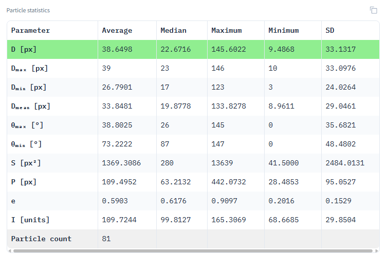
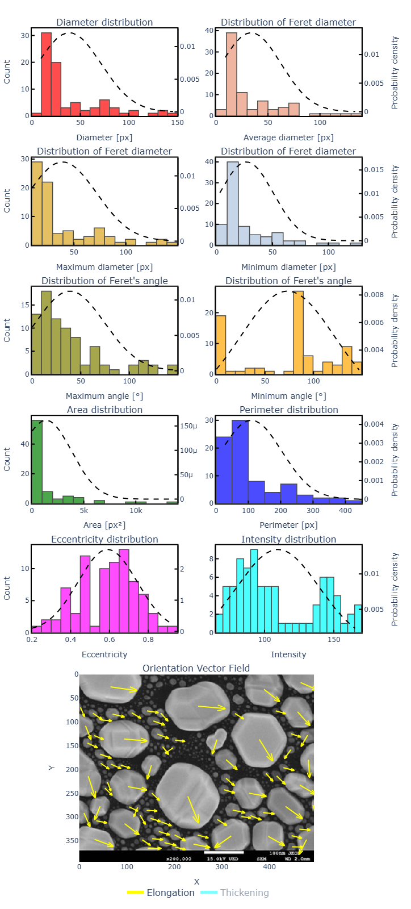
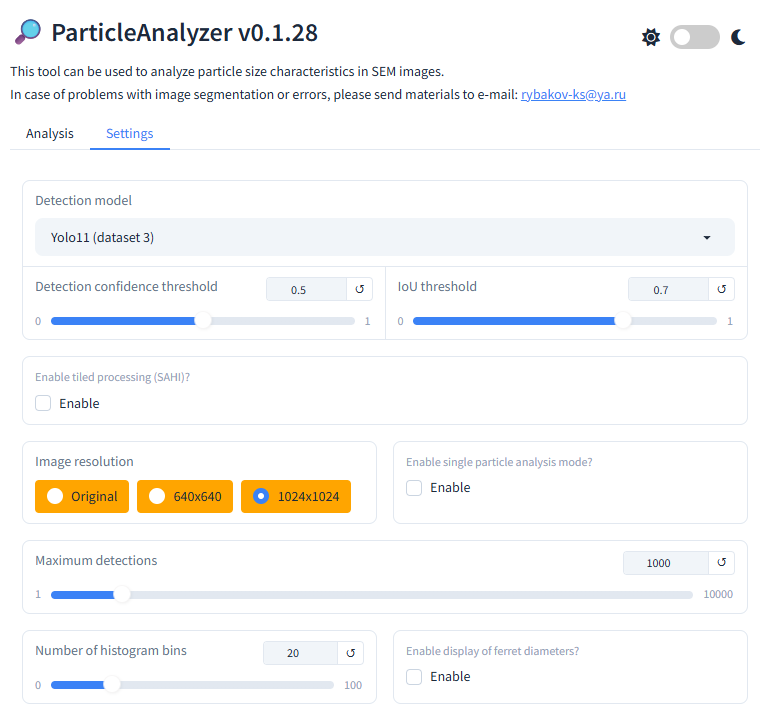
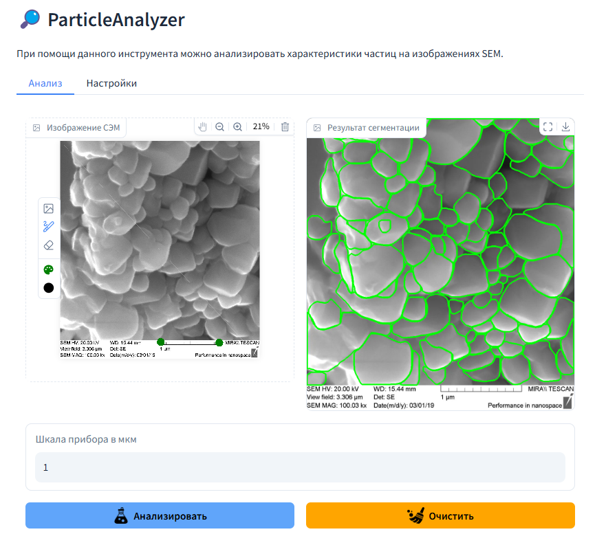
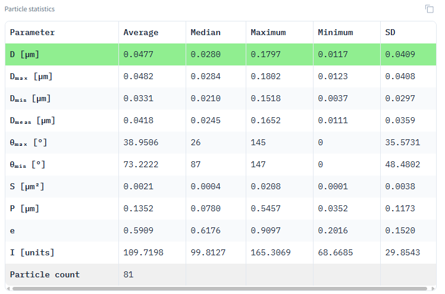

## 📑 Table of Contents

1. 🔎 [ParticleAnalyzer](#particleanalyzer)
2. ✨ [Key Features](#-key-features)
3. 📥 [Installation Guide](#-installation-guide)
   - [Prerequisites](#prerequisites)
   - [Step-by-Step Setup](#step-by-step-setup)
4. 🚀 [Launching the Application](#-launching-the-application)
5. 🛠 [Segmentation Optimization Guide](#-segmentation-optimization-guide)
6. 📊 [Analysis Outputs](#-analysis-outputs)
   - [Statistical Data Table](#statistical-data-table)
   - [Size Distribution Visualization](#size-distribution-visualization)
7. ⚙️ [Advanced Settings](#-advanced-settings)
8. 📏 [Scale Calibration](#-scale-calibration)
9. 📧 [Contributors](#-contributors)

## ParticleAnalyzer
[](https://sem.rybakov-k.ru/)

A Computer Vision Tool for Automatic Particle Segmentation and Size Analysis in Scanning Electron Microscope (SEM) Images
<p align="center">
  
</p>
## ✨ Key Features
- Automated particle segmentation in SEM images
- Comprehensive statistical analysis of particle characteristics
- Interactive visualization of size distributions
- Web-based interface for easy accessibility
- **Dual-unit display**: toggle between pixels and micrometers (µm)
- **Multiple AI models** supported (YOLOv11, YOLOv12, Detectron2)
- **Advanced settings** for precision tuning
- **Multi-language support**: Russian, Simplified Chinese, Traditional Chinese, English (ru, zh-CN, zh-TW, en-us)
- **Online version** available at [sem.rybakov-k.ru](https://sem.rybakov-k.ru/)
## 🛠 Installation Guide

### Prerequisites
- Python 3.10 or higher
- NVIDIA GPU with CUDA support (recommended)
- 16GB+ RAM for optimal performance
- **10GB+** free disk space for models

### Step-by-Step Setup

1. **Clone the repository**:
   ```bash
   git clone https://github.com/your-username/ParticleAnalyzer.git
   ```
   ```bash
   cd ParticleAnalyzer
   ```
2. **Install dependencies**:
   ```python
   pip install -r requirements.txt
   ```
   **There may be problems with the installation of Detectron2. Use the official [documentation](https://detectron2.readthedocs.io/en/latest/tutorials/install.html).*
3. **Download AI models (3.4GB)**:
   - Download model weights from [Google Drive](https://drive.google.com/file/d/10nRH_xBKfq-TtdJuZkwDpdsZSfn7Yz1G/view?usp=sharing).
   - Place files in model/ directory:
   ```bash
      model/
      ├── Yolo11_d1.pt
      ├── Yolo11_d2.pt
      ├── Yolo12_d1.pt
      ├── Yolo12_d2.pt
      ├── faster_rcnn_R_101_FPN_3x.pth
      ├── faster_rcnn_X_101_32x8d_FPN_3x.pth
      ├── cascade_mask_rcnn_R_50_FPN_3x.pth
      ├── cascade_mask_rcnn_X_152_32x8d_FPN_IN5k_gn_dconv.pth
      ├── faster_rcnn_R_101_FPN_3x.yaml
      ├── faster_rcnn_X_101_32x8d_FPN_3x.yaml
      ├── cascade_mask_rcnn_R_50_FPN_3x.yaml
      └── cascade_mask_rcnn_X_152_32x8d_FPN_IN5k_gn_dconv.yaml
   ```
## 🚀 Launching the Application
1. Run the server:
   ```python
   python app.py
   ```
2. Access the interface:
   - Open in browser: http://127.0.0.1:8000
## 🛠 Segmentation Optimization Guide
🔧 Core Parameters:
   - Model Selection
   - Detection Confidence Threshold (0-1)
     - Increase (e.g., 0.7→0.85) to reduce false positives
     - Decrease (e.g., 0.5→0.3) to detect faint particles
   - IoU Threshold (0-1)
     - Increase (e.g., 0.5→0.7) to eliminate duplicate detections
     - Decrease for dense particle fields
   - Enable SAHI Processing (split-analyze-merge)

🧩 SAHI Configuration (for large images):
   - Slice Size: Start with 400×400
   - Overlap Ratio: 0.2-0.3 (prevents edge artifacts)
   - Batch Size: Adjust based on GPU memory

🔄 Model Selection:
| Model       | Best For                   | Speed     | Recommended Use Case               |
|-------------|----------------------------|-----------|------------------------------------|
| **YOLOv11** | General use (balanced)      | ⚡⚡⚡ Fast | Quick analysis of standard samples |
| **YOLOv12** | High precision detection    | ⚡⚡ Medium | Critical measurements              |
| From **Detectron2** | Challenging morphology   | ⚡ Slow    | Irregular/overlapping particles    |
## 📊 Analysis Outputs

### Statistical Data Table
<div align="center">
  
</div>

*Comprehensive metrics including mean, median, min/max, standard deviation values for:*
- Area (px² or µm²)
- Perimeter (px or µm)
- Equivalent diameter (px or µm)
- Eccentricity (unitless)
- Intensity values (grayscale units)

### Size Distribution Visualization
<div align="center">
  
</div>

*Normal distribution fitting for all measured parameters showing particle population characteristics*

## Advanced Settings Panel
<div align="center">
  
</div>

*Configuration options include:*
- **Model Selection**: YOLOv11, YOLOv12, Detectron2
- **SAHI Mode**: Enable/disable sliced inference for large images
<div align="center">
  
</div>

- **Detection Threshold**: Confidence level (0-1)
- **IOU Threshold**: Overlap threshold for NMS (0-1)
- **Max Detections**: Maximum number of particles to detect
- **Scaling Mode**: Pixel/µm unit selection
- **Image Resolution**: Output resolution control
- **Result Rounding**: Decimal places for metrics
- **Single Particle Mode**: Detailed individual analysis
- **Histogram Bins**: Number of intervals for distribution plots

## 📐 Scale Calibration
<div align="center">
  
</div>

Micrometer values are calculated by:
1. Identifying the SEM image's scale bar using two marker points
2. Manually specifying the known real-world distance between markers
3. Automatically computing the pixel-to-µm conversion ratio
<div align="center">
  
</div>

*Note: For accurate µm measurements, please ensure:*
- The scale bar is clearly visible in your image
- You input the correct reference distance when prompted
- The scale bar was created at the same magnification as your particles

## 📧 Contributors
Rybakov Kirill (Saratov State University): rybakov-ks@ya.ru
