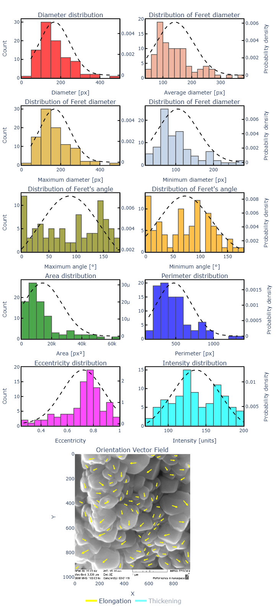

# ParticleAnalyzer

A Computer Vision-based tool for automatic segmentation and size analysis of particles in SEM (Scanning Electron Microscope) images.

## Key Features
- Automated particle segmentation in SEM images
- Comprehensive statistical analysis of particle characteristics
- Interactive visualization of size distributions
- Web-based interface for easy accessibility
- **Dual-unit display**: toggle between pixels and micrometers (µm)
- **Online version** available at [sem.rybakov-k.ru](https://sem.rybakov-k.ru/)

## Analysis Outputs

### Statistical Data Table

*Comprehensive metrics including mean, median, min/max, standard deviation values for:*
- Area (px² or µm²)
- Perimeter (px or µm)
- Equivalent diameter (px or µm)
- Eccentricity (unitless)
- Intensity values (grayscale units)

*Note: Micrometer values are calculated using the SEM image's scale bar or known pixel-to-µm ratio*

### Size Distribution Visualization

*Normal distribution fitting for all measured parameters showing particle population characteristics*
