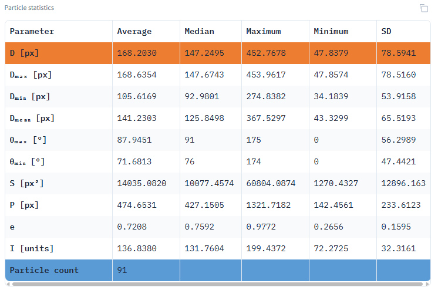

# ParticleAnalyzer

A Computer Vision Tool for Automatic Particle Segmentation and Size Analysis in Scanning Electron Microscope (SEM) Images

## Key Features
- Automated particle segmentation in SEM images
- Comprehensive statistical analysis of particle characteristics
- Interactive visualization of size distributions
- Web-based interface for easy accessibility
- **Dual-unit display**: toggle between pixels and micrometers (µm)
- **Multiple AI models** supported (YOLOv11, YOLOv12, Detectron2)
- **Advanced settings** for precision tuning
- **Online version** available at [sem.rybakov-k.ru](https://sem.rybakov-k.ru/)

## Analysis Outputs

### Statistical Data Table
\
*Comprehensive metrics including mean, median, min/max, standard deviation values for:*
- Area (px² or µm²)
- Perimeter (px or µm)
- Equivalent diameter (px or µm)
- Eccentricity (unitless)
- Intensity values (grayscale units)

### Size Distribution Visualization
\
*Normal distribution fitting for all measured parameters showing particle population characteristics*

### Advanced Settings Panel
\
*Configuration options include:*
- **Model Selection**: YOLOv11, YOLOv12, Detectron2
- **SAHI Mode**: Enable/disable sliced inference for large images

- **Detection Threshold**: Confidence level (0-1)
- **IOU Threshold**: Overlap threshold for NMS (0-1)
- **Max Detections**: Maximum number of particles to detect
- **Scaling Mode**: Pixel/µm unit selection
- **Image Resolution**: Output resolution control
- **Result Rounding**: Decimal places for metrics
- **Single Particle Mode**: Detailed individual analysis
- **Histogram Bins**: Number of intervals for distribution plots

## Scale Calibration
\
Micrometer values are calculated by:
1. Identifying the SEM image's scale bar using two marker points
2. Manually specifying the known real-world distance between markers
3. Automatically computing the pixel-to-µm conversion ratio

*Note: For accurate µm measurements, please ensure:*
- The scale bar is clearly visible in your image
- You input the correct reference distance when prompted
- The scale bar was created at the same magnification as your particles
