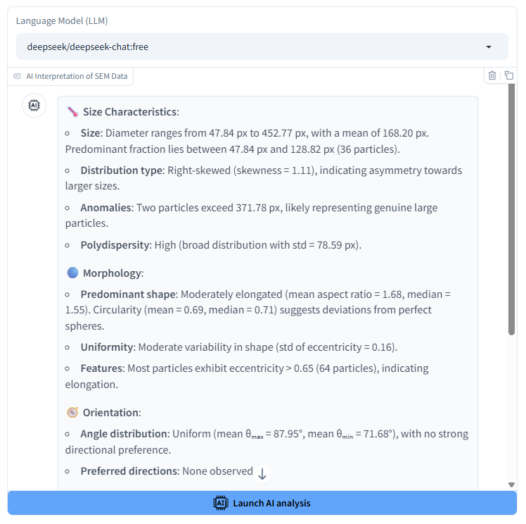
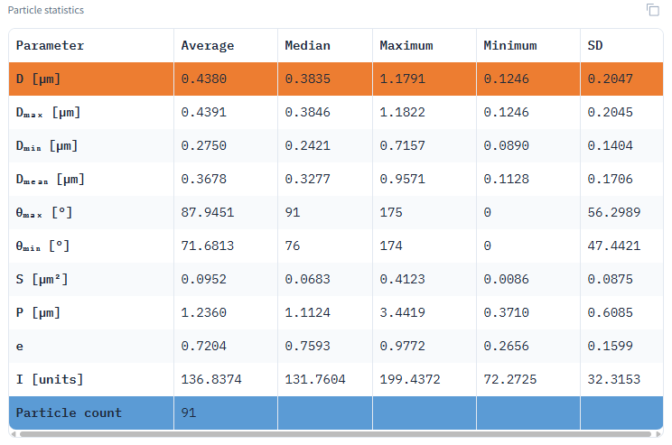

## 📑 Table of Contents

1. 🔎 [ParticleAnalyzer](#particleanalyzer)
2. ✅ [Examples](#-examples)
3. ✨ [Key Features](#-key-features)
4. 📥 [Installation Guide](#-installation-guide)
5. 🛠 [Segmentation Optimization Guide](#-segmentation-optimization-guide)
6. 📊 [Analysis Outputs](#-analysis-outputs)
7. ⚙️ [Advanced Settings](#-advanced-settings)
8. 📏 [Scale Calibration](#-scale-calibration)
9. 📧 [Contributors](#-contributors)
10. 📖 [Citation](#-citation)

## ParticleAnalyzer
[](https://particleanalyzer.ru/)
[](https://t.me/particleanalyzer_bot)
[](https://pypi.org/project/particleanalyzer/)
[](https://pepy.tech/project/particleanalyzer)
> [!WARNING]
> If you experience low performance of the demo version, we suggest following this [link](https://622e35bc68c5aa0c23.gradio.live) as a solution.


<div align="left">
  <a href="https://particleanalyzer.ru/">
    
  </a>
</div>
  <p>A Computer Vision Tool for Automatic Particle Segmentation and Size Analysis in Scanning Electron Microscope (SEM) Images.</p>

<div align="center">
  <h3>Video demonstrations:</h3>
  <p>
    <a href="Images/ParticleAnalyzer.mp4">Local video (MP4)</a> | 
    <a href="https://youtu.be/qlCuZDjDyqk">YouTube demonstration</a>
  </p>
</div>

<div align="center">
  
</div>

*If you encounter any errors while using Particle Analyzer, please open an issue in the GitHub repository or contact me at rybakov-ks@ya.ru for support.
If the model cannot segment your images correctly, please send them to rybakov-ks@ya.ru . Your images will be used to retrain the model's.*

## ✅ Examples
<table>
<tr>
<td width="50%">
<video width="100%" src="https://github.com/user-attachments/assets/41d3feb1-a7db-451f-a804-9f2fbf42ebf5" controls></video>
</td>
<td width="50%">
<video width="100%" src="https://github.com/user-attachments/assets/c762d7a0-3bd7-42e7-aa77-92759066fbb6" controls></video>
</td>
</tr>
<tr>
<td width="50%">
<video width="100%" src="https://github.com/user-attachments/assets/5c38cf15-c721-4929-adfb-4ce6a6912eed" controls></video>
</td>
<td width="50%">
<video width="100%" src="https://github.com/user-attachments/assets/345695f4-f00c-4410-87d9-edcee64c6df3" controls></video>
</td>
</tr>
<tr>
<td width="50%">
<video width="100%" src="https://github.com/user-attachments/assets/ff6f07ce-e778-4451-b044-718e604f73a1" controls></video>
</td>
<td width="50%">
</td>
</tr>
</table>

## ✨ Key Features
- Automated particle segmentation in SEM images
- SAHI mode enables accurate detection of small particles in high-resolution images via a sliding window method
- Comprehensive statistical analysis of particle characteristics
- Interactive visualization of size distributions
- Dual unit support — switch between pixels and micrometers (µm)
- Supports multiple AI models: YOLOv11, YOLOv12, and Detectron2
- Advanced configuration options for fine-tuning detection accuracy
- AI Interpretation of SEM Data
- Multi-language interface: Russian, Simplified Chinese, Traditional Chinese, English (ru, zh-CN, zh-TW, en)
- Try it online: [particleanalyzer.ru](https://particleanalyzer.ru)

## 🛠 Installation Guide

 ### 1. 📥 Install PyTorch with CUDA support
Make sure your system has an NVIDIA GPU with CUDA. Install [PyTorch](https://pytorch.org/get-started/locally/) using the appropriate CUDA version (e.g., CUDA 11.8):
   ```python
   pip install torch torchvision torchaudio --index-url https://download.pytorch.org/whl/cu118
   ```
If you do not have a CUDA-capable GPU, use the CPU version instead—however, in this case, ParticleAnalyzer will run significantly slower:
   ```python
   pip install torch torchvision torchaudio
   ```
### 🧪 2. Install Detectron2 (Optional)

If you want to enable advanced instance segmentation, install Detectron2:
```python
pip install 'git+https://github.com/facebookresearch/detectron2.git'
```
> [!WARNING]
> *There may be problems installing Detectron2. Use the official [documentation](https://detectron2.readthedocs.io/en/latest/tutorials/install.html).*
### 📦 3. Install ParticleAnalyzer
Finally, install ParticleAnalyzer from PyPI:
```python
pip install --upgrade ParticleAnalyzer
```
✅ Now you're ready to run the application:
```python
ParticleAnalyzer run
```
Open in browser: http://127.0.0.1:8000 

You can specify the port if necessary:
```python
ParticleAnalyzer run --port 5000
```

Launch with LLM support ([OpenRouter](https://openrouter.ai/settings/keys) or [Hugging Face](https://huggingface.co/settings/tokens) API key required):
```python
ParticleAnalyzer run --port 5000 --api-key YOUR_OPENROUTER_API_KEY
```

## 🛠 Segmentation Optimization Guide
🔧 Core Parameters:
   - Model Selection
   - Detection Confidence Threshold (0-1)
     - Increase (e.g., 0.7→0.85) to reduce false positives
     - Decrease (e.g., 0.5→0.3) to detect faint particles
   - IoU Threshold (0-1)
     - Increase (e.g., 0.5→0.7) to eliminate duplicate detections
     - Decrease for dense particle fields
   - Enable SAHI Processing (split-analyze-merge)

🧩 SAHI Configuration (for large images):
   - Slice Size: Start with 400×400
   - Overlap Ratio: 0.2-0.3 (prevents edge artifacts)\
*SAHI mode helps detect small objects in high-resolution images by using a sliding window approach*

🔄 Model Selection:
<div align="center">
   
| Model       | Best For                   | Speed     | Recommended Use Case               |
|-------------|----------------------------|-----------|------------------------------------|
| **YOLOv11** 🆕 | General use (balanced)      | ⚡⚡⚡ Fast | Quick analysis of standard samples |
| **YOLOv12** 🆕 | High precision detection    | ⚡⚡⚡ Fast | Critical measurements              |
| **Mask R-CNN X152** 🆕 | Challenging morphology   | ⚡ Slow    | Irregular/overlapping particles    |

</div>

## 📊 Analysis Outputs

### Statistical Data Table
<div align="center">
  
</div>

<div align="center">
  
</div>

*Comprehensive metrics including mean, median, min/max, standard deviation values for:*

- Area (px² or µm²)
- Perimeter (px or µm)
- Equivalent diameter (px or µm)
- Feret diameters and angles (px or µm and °)
- Eccentricity (unitless)
- Intensity values (grayscale units)

### Size Distribution Visualization
<div align="center">
  
</div>

*Normal distribution fitting for all measured parameters showing particle population characteristics*

### Data filtering

https://github.com/user-attachments/assets/6548071a-3c83-4539-897a-6ebf175bec17

**AI Interpretation of SEM Data**
<div align="center">
  
</div>

## Advanced Settings Panel
<div align="center">
  
</div>

*Configuration options include:*
- **Model Selection**: YOLOv11, YOLOv12, Detectron2
- **SAHI Mode**: Enable/disable sliced inference for large images
<div align="center">
  
</div>

- **Detection Threshold**: Confidence level (0-1)
- **IOU Threshold**: Overlap threshold for NMS (0-1)
- **Max Detections**: Maximum number of particles to detect
- **Scaling Mode**: Pixel/µm unit selection
- **Image Resolution**: Output resolution control
- **Result Rounding**: Decimal places for metrics
- **Single Particle Mode**: Detailed individual analysis
- **Histogram Bins**: Number of intervals for distribution plots

## 📐 Scale Calibration

  https://github.com/user-attachments/assets/12ccb7b5-4dbc-4472-afcb-574332947971

Micrometer values are calculated by:
1. Identifying the SEM image's scale bar using two marker points
2. Manually specifying the known real-world distance between markers
3. Automatically computing the pixel-to-µm conversion ratio
<div align="center">
  
</div>

*Note: For accurate µm measurements, please ensure:*
- The scale bar is clearly visible in your image
- Enter the correct scale
- The scale bar was created at the same magnification as your particles

## 📧 Contributors  
Kirill Rybakov, PhD | Chemistry  
Affiliation: Saratov State University  
*Email*: [rybakov-ks@ya.ru](mailto:rybakov-ks@ya.ru)

## 📖 Citation
If you plan to publish results obtained using ParticleAnalyzer, we would appreciate it if you mention the use of ParticleAnalyzer (https://github.com/rybakov-ks/ParticleAnalyzer).
